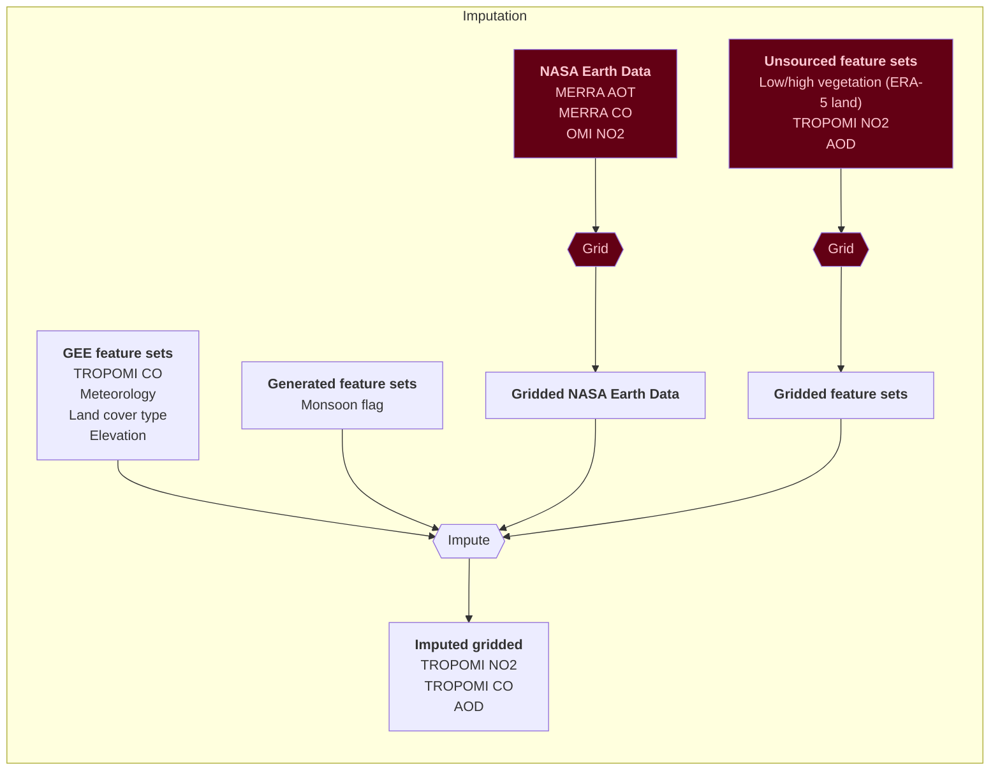

# PM2.5 predictions in India
- Two-stage machine learning model for daily PM2.5 predictions at a 10 km resolution in India, from 2005 to 2023
- Published in Science Advances. https://www.science.org/doi/10.1126/sciadv.adq1071
- Output PM2.5 estimates across India are publicly available and can be downloaded here: https://zenodo.org/records/13694585

## Citation
Kawano, Ayako, Makoto Kelp, Minghao Qiu, Kirat Singh, Eeshan Chaturvedi, Sunil Dahiya, Inés Azevedo, and Marshall Burke. "Improved daily PM2. 5 estimates in India reveal inequalities in recent enhancement of air quality." Science Advances 11, no. 4 (2025): eadq1071.

## 1. Collect input features
- Scripts to download input features from Google Earth Engine have been included in the repository. 
- The rest of the features, namely MERRA-2 CO, MERRA-2 AOT, and OMI NO2, need to be collected separately by downloading the raw data from NASA Earthdata and values needed to be extracted to each grid in the grid_india_10km shapefiles.  

## 2. First stage ML to impute missing data in TROPOMI NO2, TROPOMI CO, and MODIS AOD
- LightGBM for NO2
- XGBoost for CO and AOD

## 3. Second stage ML to predict PM2.5 concentrations across India

## Diagrams

