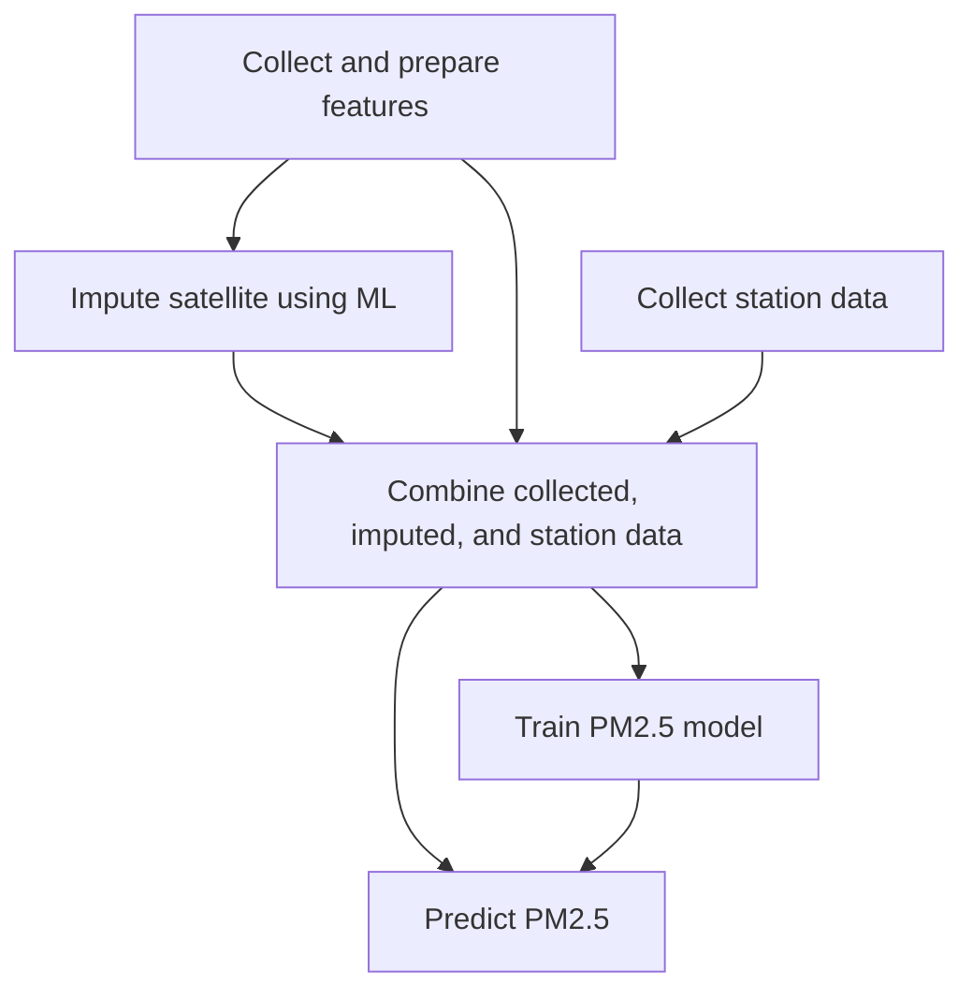
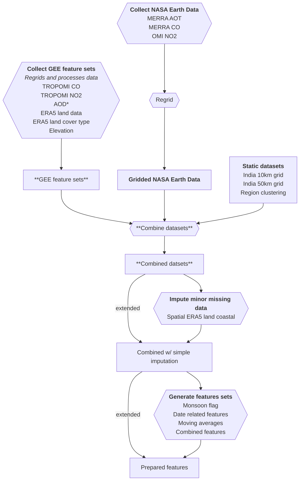
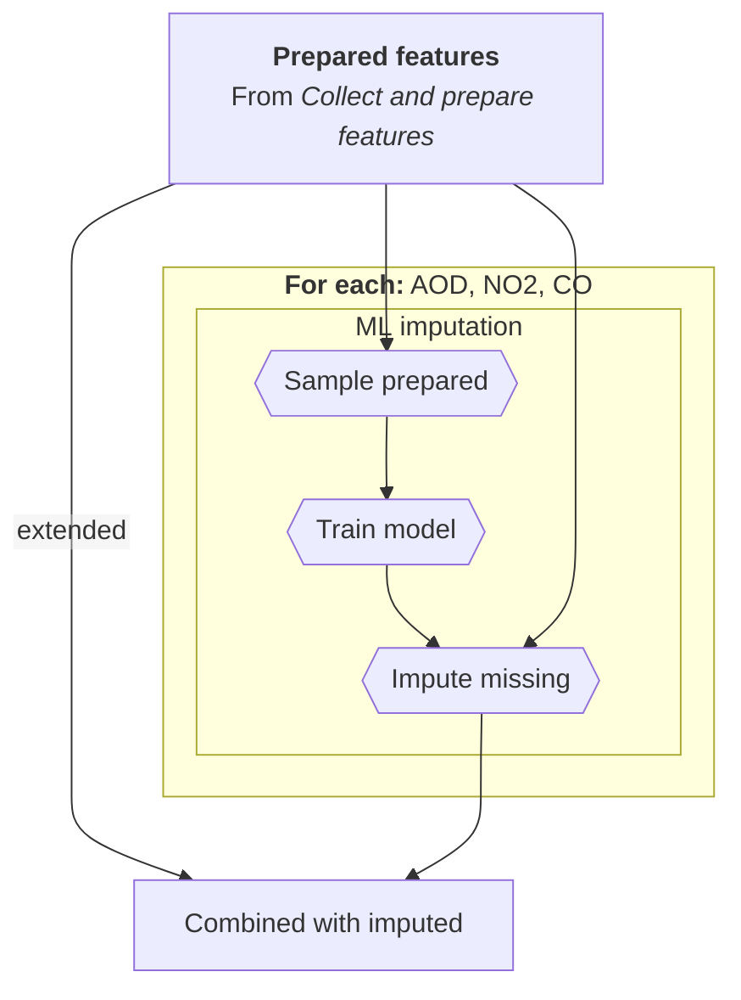
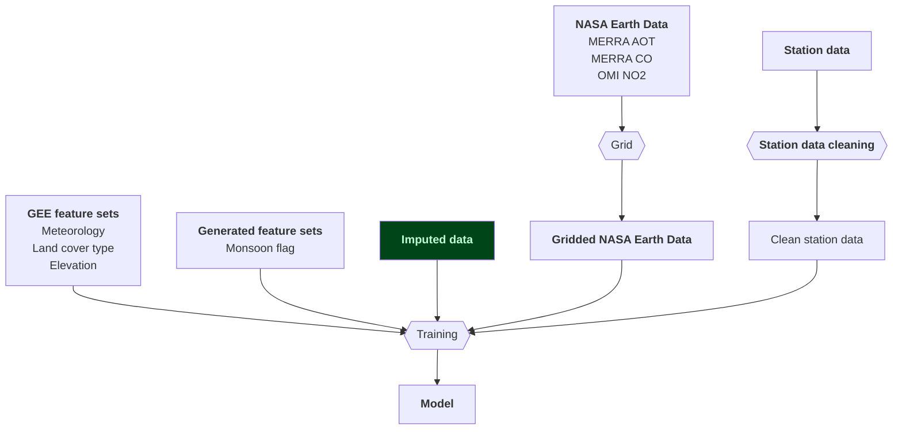

# PM2.5 predictions in India

The aim of this project is to regularly produce raster PM2.5 predictions at a 10 km resolution in
India. It features a two-stage machine learning model for daily PM2.5 predictions.

Based on *[Improved daily PM2.5 estimates in India reveal inequalities in recent enhancement of air quality]*.
This paper created results from 2005-2023 can be [downloaded from Zenodo].

## Project layout

The `pm25ml` is where most of the code for this project can be found.

We have additional directories:
 - `experiments`: Experiments to inform implementation and to understand reference code.
 - `reference`: The files from the original forked project.

## Contributing

### Getting started

We use poetry to manage the project. To install the dependencies needed run:
```
poetry install --only main,dev
```

### Dependencies

We use different poetry groups to manage the dependencies: `main` (default), `dev`, `experiment`,
and `reference`. `experiment` and `reference` are used for the `experiments` and `reference` directories.
When adding dependencies, make sure you add them to the correct group.

> [!IMPORTANT]
> Do not add any dependencies that use GDAL to the project. We avoid GDAL to simplify the environment
> for running the code.

### Testing

Add unit tests for new classes and functions. When committing, make sure the tests pass.

We use pytest for the tests. The test files live alongside with original file with the suffixes:
`__test.py` for unit tests or `__it.py` for integration tests.

> [!IMPORTANT]
> When adding new integration tests, these must be marked with `pytest.mark.integration`.

You can run the unit tests from the command line with:
```
poetry run pytest -m "not integration"
```

And you can run the integration tests from the command line with:
```
poetry run pytest -m "integration"
```

The integration tests expect you to be already set up and authenticated in your environment to use:
 - A Google Cloud project
 - NASA Earthaccess
 - Google Earth Engine 
 - A bucket for test assets (with an environment variable `IT_GEE_ASSET_BUCKET_NAME` for the name set)
 - An environment variable set for `IT_GEE_ASSET_ROOT`, which is where you want the test assets to go
   in GEE.

### Code standards

We use the "ALL" rules configuration provided by ruff, with an extended line-length of 100
characters.

To make sure your code meets our code standards, install the [`pre-commit`](https://pre-commit.com/)
configuration provided so that your code is checked before committing:
1. Install `pre-commit`, if you haven't already
2. [Install the git hook scripts](https://pre-commit.com/#3-install-the-git-hook-scripts)

## Implementation

This shows the overall process flow for the application. More detail is provided on some of these
areas in the document below.



### Collect and prepare features

We collect and combine data for each month in the analysis period.

Simple imputation that happens at this stage can include spatial or temporal imputation using
nearest neighbour or interpolation.



### Impute satellite using ML

This shows the processing that happens at the satellite imputation stage.



### Train PM2.5 model

This shows the data needed to train the model.



## Citations

### Models

Kawano, Ayako, Makoto Kelp, Minghao Qiu, Kirat Singh, Eeshan Chaturvedi, Sunil Dahiya,
Inés Azevedo, and Marshall Burke. "Improved daily PM2. 5 estimates in India reveal inequalities in
recent enhancement of air quality." Science Advances 11, no. 4 (2025): eadq1071.

### Bundled test datasets

#### `M2T1NXAER.5.12.4_MERRA2_400.tavg1_2d_aer_Nx.20230101_TOTEXTTAU_subsetted.nc4`

NASA Global Modeling and Assimilation Office (GMAO). (2015).
*MERRA-2 tavg1_2d_aer_Nx: Aerosol Diagnostics, Hourly 0.5° × 0.625°, V5.12.4 (M2T1NXAER)* [Data set].
Goddard Earth Sciences Data and Information Services Center (GES DISC), NASA GSFC.
https://doi.org/10.5067/KLICLTZ8EM9D  
(Accessed 24 Jun 2025; licence — CC-0 1.0. NASA does not endorse this software.)

#### `OMI-Aura_L3-OMNO2d_2023m0111_v003-2023m0223t191034.he5`

NASA Goddard Space Flight Center. (2023).
*OMI/Aura NO₂ Cloud-Screened Total and Tropospheric Column L3 Global Gridded 0.25° × 0.25° V003* (OMNO2d) [Data set].
NASA Goddard Earth Sciences Data and Information Services Center (GES DISC).
https://doi.org/10.5067/Aura/OMI/DATA3002  
(Accessed 24 Jun 2025; licence — CC-0 1.0. NASA does not endorse this software.)

[Improved daily PM2.5 estimates in India reveal inequalities in recent enhancement of air quality]: https://www.science.org/doi/10.1126/sciadv.adq1071
[downloaded from Zenodo]: https://zenodo.org/records/13694585
