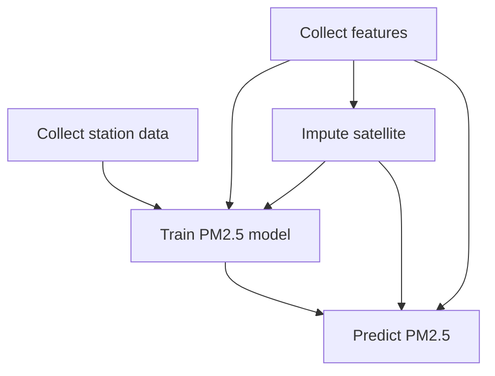
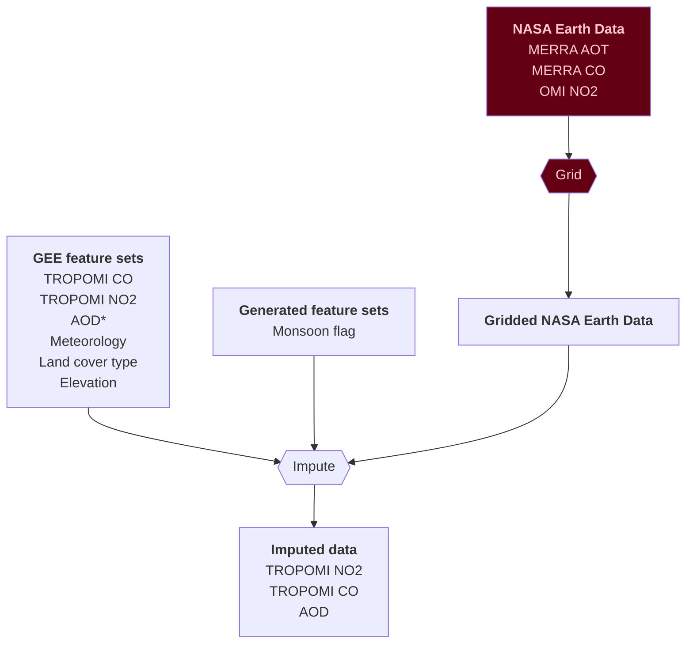
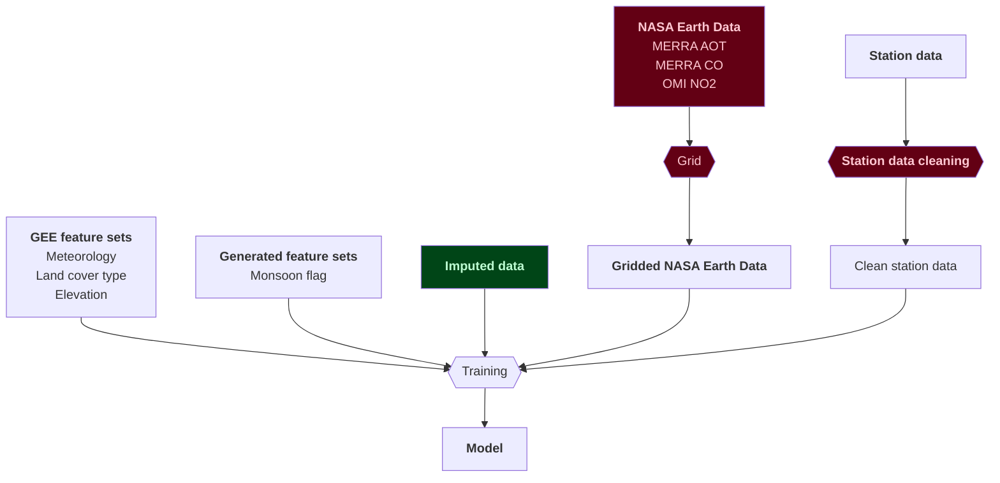

# PM2.5 predictions in India
- Two-stage machine learning model for daily PM2.5 predictions at a 10 km resolution in India, from 2005 to 2023
- Published in Science Advances. https://www.science.org/doi/10.1126/sciadv.adq1071
- Output PM2.5 estimates across India are publicly available and can be downloaded here: https://zenodo.org/records/13694585

## Citation
Kawano, Ayako, Makoto Kelp, Minghao Qiu, Kirat Singh, Eeshan Chaturvedi, Sunil Dahiya, Inés Azevedo, and Marshall Burke. "Improved daily PM2. 5 estimates in India reveal inequalities in recent enhancement of air quality." Science Advances 11, no. 4 (2025): eadq1071.

### Contributing

#### Code standards

We use the "ALL" rules configuration provided by ruff, with an extended line-length of 100
characters.

To make sure your code meets our code standards, install the [`pre-commit`](https://pre-commit.com/)
configuration provided so that your code is checked before committing:
1. Install `pre-commit`, if you haven't already
2. [Install the git hook scripts](https://pre-commit.com/#3-install-the-git-hook-scripts)

### Process dependencies overview

This shows the overall process flow and dependencies for the modelling.

### Imputing data

This shows the data needed to impute the data.

### Training the model

This shows the data needed to train the model.

